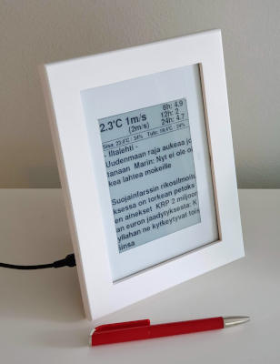
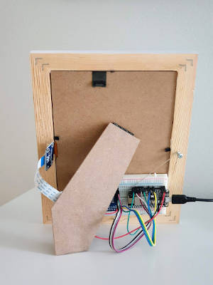

# E-paper (e-ink) dashboard project for the ESP8266
The e-paper dashboard displays current weather and news on the e-ink display. The e-ink display is placed to the flat frame to have a clean end result. The display is drived by the ESP8266 microcontroller. The ESP8266 calls periodically the backend service (AWS Lambda), parses the data and displays the data. 




The backend AWS Lambda collects the data from the various datasources such as the weather service and news RSS feeds. The Lambda returns the data as a JSON string.

Example JSON response from the Lambda:

```json
{
    "tempOut": 4.1,
    "rhOut": 71,
    "ws10Out": 3.2,
    "wg10Out": 4.7,
    "temp6h": -0.8,
    "temp12h": -0.5,
    "temp24h": -3.9,
    "tempIn": 23.8,
    "rhIn": 35,
    "tempTulo": 19.8,
    "rhTulo": 20,
    "rss": [
        "Iltalehti",
        "Netflix huonontaa kuvanlaatuaan Euroopassa - syyna koronavirus",
        "Britannia haluaa ostaa superaseen koronataisteluun",
        "Asiantuntijat myonsivat: Jos nykykeinot eivat auta, koulut",
        "Nain koronavirus etenee kehossa",
        "Real-tahti rikkoi koronakaranteenia - jopa vankilatuomio uhkaa",
        "Heikilta, 75, suorat sanat rajoituksia rikkoville ikaihmisille"
    ]
}
```

## Electrical components
- E-paper display: Waveshare 5.83 inch 600x448 B&W
- ESP8266: NodeMCU (Amica)

## Libraries
- GxEPD2_BW
- ESP8266WiFi
- WiFiClientSecure
- ArduinoJson

## AWS Python Lambda
- epaper-dashboard-backend.py
- The AWS infra (API Gateway) is deployed manually

## IDE
- Arduino IDE

## Credits
Copyright (c) 2020 Mika Mäkelä
